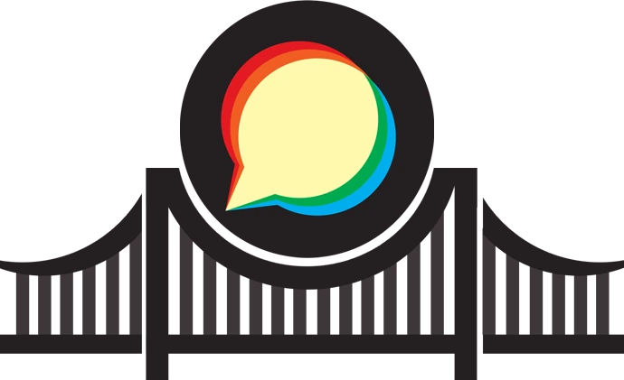

# Discourse-chat-bridge

  
  
A chat bridge allowing users to post, reply and interact with discourse posts from their own favorite chat platforms.

  <a href="installation" class="md-button md-button--primary">Installation</a>

## Bridge Features

- fetch the latest published topic 📄
- fetch categories ⬇️
- Post a new topic 📝
- Post a new comment 💬
- Send a private message 🔒
- Link your chat account with your discussion account
- Receive the latest topics posted from the bot

## Supported platforms
- Matrix
- Telegram

## License
Discourse-chat-bridge is licensed under the AGPLv3.

