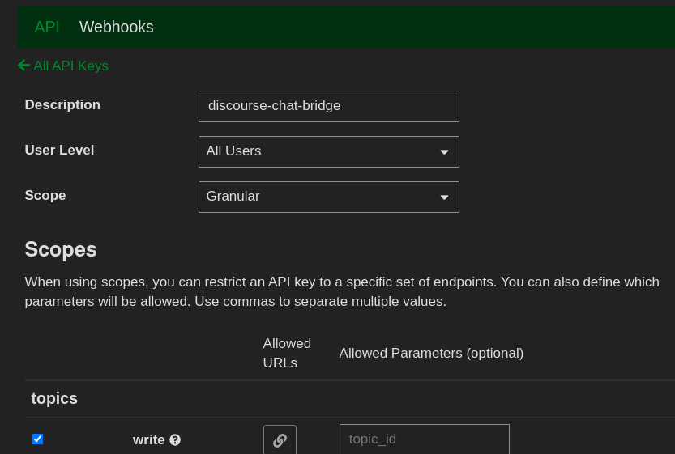

# Installation

## Discourse setup
Go to Admin Settings > API and create a new API key.
It should have a granular scope and be able to access all users.
Make sure you also give the token topics write access.



### installation with docker-compose.yml
```yaml
services:
    discourse-chat-bridge:
        image: oci.aosus.org/aosus/discourse-chat-bridge:latest
        restart: always
        environment:
            URL: "https://discourse.example.com"
            DISCOURSE_FORUM_NAME: "Discourse community"
            DISCOURSE_TOKEN: "API key with write access for all users"
            DISCOURSE_USERNAME: "username to be used for Direct messages from the bridge"
            TELEGRAM_TOKEN: ""
            MATRIX_USERNAME: ""
            #MATRIX_PASSWORD: "" matrix password shouldn't beused in env variables, rather you should directly set the access token.
            MATRIX_HOMESERVER_URL: "https://matrix.example.com"
            MATRIX_ACCESS_TOKEN: ""
            MATRIX_AUTOJOIN: TRUE
            DATAPATH: /data
            MATRIX_ENCRYPTION: TRUE
            language: "en"
        volumes:
            ./data:/data:rw:z
```

Then you can start the container
```bash
docker compose up -d
```

## Native
```bash
git clone https://github.com/aosus/discourse-chat-bridge
```

edit `config.json` and add required inputs
```json
{
	"url": "https://$DISCOURSE_DOMAIN",
	"discourse_forum_name": "discourse forum name",
	"discourse_token": "API key with write access for all users",
	"discourse_username": "username to be used for Direct messages from the bridge",
	"telegram_token": "",
	"matrix_username": "Username to your Matrix account #aosus",
	"matrix_password": "Password to your Matrix account to generate the access token, you can skip this by inputing it directly",
	"matrix_homeserver_url": "https://matrix.org",
	"matrix_access_token": "Put your matrix_access_token here #npm run generate_matrix_token",
	"matrix_autojoin": true,
	"dataPath": "./storage",
	"matrix_encryption": true,
	"language": "en"
}
```

Then start it up!

```bash
npm i
npm run generate_matrix_token
npm start
or
node index.js
```
